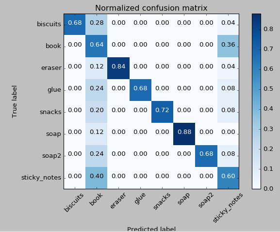

## Project: Perception

### Introduction  
The purpose of the perception project focuses the students to learn about visualizing and sorting through arryas of 3d point clouds and the different algorithms that are used to gain useful information about a point cloud and its environment.  The Project consisted of 3 exercises and a final project.  The exercies are designed to take a point cloud and apply different filters to segment a set of objects from an environment, and then extract that object to extract normal and color histogams that can be fed as training data into an SVM for classification.  I will be discussing the details of each of the exercises and the final project.


### Ex 1
Exercise one started with reading in a static point cloud to begin testing the voxel grid downsampling, passthrough filter, Ransac segmentation, and outlier extraction.  The quick steps of this process are: down sample to remove extra un-needed points from the point cloud, cut off the extra part of the scene in the z direction, filter by shapes using RANSAC, and then extract inliers and outliers for the segmented scene.  These 4 steps were able to  take some objects on a table and extract only the objects.  The Voxel downsamplig filter takes a sample of the point cloud and extracts the point within a volume element size.  

```python
# Create a VoxelGrid filter object for our input point cloud
vox = cloud.make_voxel_grid_filter()

# Choose a voxel (also known as leaf) size
# Note: this (1) is a poor choice of leaf size   
# Experiment and find the appropriate size!
LEAF_SIZE = .01  

# Set the voxel (or leaf) size  
vox.set_leaf_size(LEAF_SIZE, LEAF_SIZE, LEAF_SIZE)

# Call the filter function to obtain the resultant downsampled point cloud
cloud_filtered = vox.filter()
filename = 'voxel_downsampled.pcd'
pcl.save(cloud_filtered, filename)
```

The next step for exercise 1 was to implement a passthrough filter to eliminate the bottom portion of the table and take as much of the table top away from the point cloud.  This fileter is axis specific with a minimuim and a maximum user specified values which limit the length of the clipping action.  The code to implement this passthrough filter looks like this.

```python
# PassThrough filter
# Create a PassThrough filter object.
passthrough = cloud_filtered.make_passthrough_filter()

# Assign axis and range to the passthrough filter object.
filter_axis = 'z'
passthrough.set_filter_field_name(filter_axis)
axis_min = .6
axis_max = 1.1
passthrough.set_filter_limits(axis_min, axis_max)

# Finally use the filter function to obtain the resultant point cloud. 
cloud_filtered = passthrough.filter()
filename = 'pass_through_filtered.pcd'
pcl.save(cloud_filtered, filename)
```
I set my values to .6 and 1.1 for the min and max values respectively.  I thought this did the best job of clipping the unwated information from the point cloud.

The next filter applied in exercise 1 one was the RANSAC segmentation.  The purpose of this filter allows the user to identify unique shapes within an environment and then choose to extract the objects identified or the objects that represent the outliers.  The code used to accomplish this task is shown below.

```python
# Create the segmentation object
seg = cloud_filtered.make_segmenter()

# Set the model you wish to fit 
seg.set_model_type(pcl.SACMODEL_PLANE)
seg.set_method_type(pcl.SAC_RANSAC)

# Max distance for a point to be considered fitting the model
# Experiment with different values for max_distance 
# for segmenting the table
max_distance = .01
seg.set_distance_threshold(max_distance)

# Call the segment function to obtain set of inlier indices and model coefficients
inliers, coefficients = seg.segment()
```

Using all three code snippets above the final output is shown below.  These point cloud files were saved locally to the directory I was working in and the image under manipulation was static.  To verify that my code was working correctly I had to call pcl_viewer from the terminal window to see the effects each of the filters had on the original image.

### Ex1 extracted outliers


### Ex 2
Exercise two started with the code developed from exercise 1 and connected it to a subscriber interfaced with a camera in the Gazebo environement The exercise 2 script published the manipulated point cloud to a topic which could be viewed in in Rviz.  Euclidean clustering with k-d trees was used to cluster the point clouds and extract the segmented objects.  These objects had the point clouds converted to just x y z data b removing the color portion of the point cloud.  A random color generator was then used to display the geometry point clouds with random different colors.       

```python
# TODO: Euclidean Clustering
    white_cloud = XYZRGB_to_XYZ(extracted_outliers) 
    #Create k-d tree from converted point cloud    
    tree = white_cloud.make_kdtree()
    #Create euclidean cluster extraction object
    ec = white_cloud.make_EuclideanClusterExtraction()
    #set euclidian cluster settings to cluster by    
    ec.set_ClusterTolerance(0.01)
    ec.set_MinClusterSize(20)
    ec.set_MaxClusterSize(20000)
    #Search the k-d tree for clusters
    ec.set_SearchMethod(tree)
    #Extract indices for each of the discovered clusters
    cluster_indices = ec.Extract()
```

```python
 # TODO: Create Cluster-Mask Point Cloud to visualize each cluster separately
    # to loop through a array and assign values to r g b and list item  
    color_cluster_point_list = []

    #get colors for color list
    cluster_color = get_color_list(len(cluster_indices))
    
    
    #iterate thought the cluster indices building a nx4 array the length of the color
    #list with color label     
    for j, indices in enumerate(cluster_indices):
        for i, indice in enumerate(indices):
            color_cluster_point_list.append([white_cloud[indice][0],
                                             white_cloud[indice][1],
                                             white_cloud[indice][2],
                                             rgb_to_float(cluster_color[j])])
    
    # TODO: Create Cluster-Mask Point Cloud to visualize each cluster separately
    #create new cloud that contains all clusters, each with unique color
    cluster_cloud = pcl.PointCloud_PointXYZRGB()
    cluster_cloud.from_list(color_cluster_point_list)
    
    
    # TODO: Convert PCL data to ROS messages
    ros_cloud_objects = pcl_to_ros(extracted_outliers)
    ros_cloud_table = pcl_to_ros(extracted_inliers)
    ros_cluster_cloud = pcl_to_ros(cluster_cloud)
```

### Clustered Point cloud


## Ex 3
Exercise 3 was an introduction to color and normal histograms along with Support Vector Machines and how they can be used together.  Obtaining historgrams packed with color and normal information was explored in a jupyter notebook.  different images were uploaded and then the rgb and hsv histograms were displayed to explore the differences between the pictures.  The number of bins can have a large impact on the accuracy of the histograms.  The number of bins relates to how many seperate categories the historgram will be seperated into. This was one of the historgrams that I analyzed within a jupyter notebook, I choose to include it because it is simple to understand.  The piece of brocoli is largely green therefore the RGB histogram developed show only values in green.  If I had increased the number of bins there would be more variation the green region.  The normal histograms output vector that are othonormal to the points in the point cloud therefore representing the approximate shaped of the object. 

### RGB HSV histogram for brocoli


In order to train the SVM a large number of samples had to be collected of the objects in order to train the SVM and perform classification.  This was accomplished with the training.launch file within the sensor_stick directory and  capture_features.py / features.py files.  Features.py was responsible for calculating the color and normal histograms and capture features.py controlled the number of samples to be captured and also the orginization of the data.  I started with low values for the number of samples captured to estimate the number of samples to obtain an accuracy of at least 80% for the overall probability.  For the final training_set for exercise 3 150 samples per item was captured with the number of bins set to 32 this yielded the following confustion matrix.


```python
for index, pts_list in enumerate(cluster_indices):
        # Grab the points for the cluster from the extracted outliers (cloud objects)
        #these points  #are in the form of XYZRGB
        pcl_cluster = extracted_outliers.extract(pts_list)
        print('index')
        print(index)
        #print('pts_list')
        #print(pts_list)      
        #convert cluster from pcl to ros for transmission through subscriber
        ros_cloud = pcl_to_ros(pcl_cluster)        
                
        # Compute the associated feature vector
        # Extract histogram features
        chists = compute_color_histograms(ros_cloud, using_hsv=True)
        normals = get_normals(ros_cloud)
        nhists = compute_normal_histograms(normals)
        feature = np.concatenate((chists, nhists))
     
        # Make the prediction
        # Make the prediction
        prediction = clf.predict(scaler.transform(feature.reshape(1,-1)))
        label = encoder.inverse_transform(prediction)[0]
        detected_objects_labels.append(label)
          
        # Publish a label into RViz
        label_pos = list(white_cloud[pts_list[0]])
        label_pos[2] +=.4
        object_markers_pub.publish(make_label(label,label_pos,index))                        
                    
        # Add the detected object to the list of detected objects.
        do = DetectedObject()
        do.label = label
        do.cloud = ros_cloud
        detected_objects.append(do)
        detected_objects_pub.publish(detected_objects) 
```
### Project Implementation
Using the same method as used for exercise 3 a set of samples for the 8 new items had to be captured.  I wanted to compare the impact of different color schemes to the accuracy in which the items could be identified with respect to the SVM.  I ran small grops of samples, 25 for each item.  Looking at the confusion matrices for the hsv and rgb sample I choose to go with hsv for my main sample set to tain my svm classifier.
### Normalized Confusion Matrix Ex 3


### Hsv only confusion matrix


### Hsv and Rgb confusion matrix




### Rgb only confusion matrix


I captured 200 samples of each object wiht number of bins set to 128 for the normal/hsv histograms and trained the SVM with a rbf kernel.  After the code had been tested successfully within the 1st world, modifications were made to the ```pick_place_project.launch``` file.  The modifications changed the spawn option to the 2nd and 3rd worlds and pick lists respectively.  each time the launch file was changed the ```pr2.py``` file was also changed to reflect the correct output file land test scene.  The results with screenshots of each world are shown below.  
## SMV Accuracy


trajectory_sampler_snip.PNG

### World 1 output with labels


### World 2 output with labels


### World 3 output with labels 1/2


### World 3 output with labels 2/2


### Conclusion
Overall I really enjoyed this project and would have like more time to explore sending service messages to the robot and manipulating the joints in the Rviz and gazebo environment.  My SVM did a good job recognizing the objects.  The hardest part about this project was obtaining the samples from the ```training.launch``` environment.  I had issues with the system locking op or crashing.  Gazebo occasionally would crash during this process.  When taking snips of the classifiation output on screen the screen shots for world 3 were the most difficult.  The looping of pr2.py appeared to slow to keep all of the labels displayed on the output at the same time.  This could have been due to the classification error made on the book.  The label for snacks is dropped and an extra label for glue appears.  I was unsure if this is due to a formatting issue with the labels or an error made by the classifier.  All of the other worlds and pick lists appeared correct with no classification errors.  The output .yaml files were 100% correct with respect to the pick list 1 and 2.  The output .yaml file for picklist 3 had an extra glue request but it still had the snack request.

### Final SVM confuction matrix


