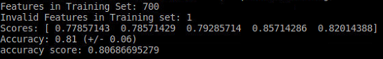
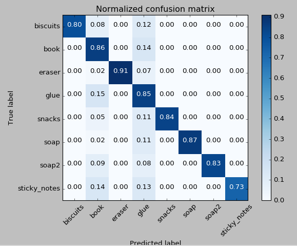

## Project: Perception

### Introduction  
The purpose of the perception project focuses the students to learn about visualizing and sorting through arryas of 3d point clouds and the different algorithms that are used to gain useful information about an environment.  The Project consisted of 3 exercises and a final project.  The exercies are designed to take a point cloud and apply different filters to segment a set of objects from an environment.  I will be discussing the details of each of the exercises and the final project.


### Ex 1
Exercise one consisted of reading in a point cloud through a ros susbscriber and applying a voxel downsampling grid, passthrough filter, Ransac segmentation, and outlier extraction.  These 4 steps allowed the user to take some objects on a table and extract only the objects.  The Voxel downsamplig filter takes a sample of the point cloud and extracts the point within a volume element size.  This volume element size determines the output resolution of the voxel filter.  I choose my value to be .01 for the exercises.  I choose a different value for the project but that will be discussed in detail later.  The code for the voxel downsample looks like this.  

```python
# Create a VoxelGrid filter object for our input point cloud
vox = cloud.make_voxel_grid_filter()

# Choose a voxel (also known as leaf) size
# Note: this (1) is a poor choice of leaf size   
# Experiment and find the appropriate size!
LEAF_SIZE = .01  

# Set the voxel (or leaf) size  
vox.set_leaf_size(LEAF_SIZE, LEAF_SIZE, LEAF_SIZE)

# Call the filter function to obtain the resultant downsampled point cloud
cloud_filtered = vox.filter()
filename = 'voxel_downsampled.pcd'
pcl.save(cloud_filtered, filename)
```

The next step for exercise 3 was to implement a passthrough filter to eliminate the bottom portion of the table and take as much of the table top away from the point cloud.  This fileter is axis specific with a minimuim and a maximum user specified values which limit the length of the clipping action.  The code to implement this passthrough filter looks like this.

```python
# PassThrough filter
# Create a PassThrough filter object.
passthrough = cloud_filtered.make_passthrough_filter()

# Assign axis and range to the passthrough filter object.
filter_axis = 'z'
passthrough.set_filter_field_name(filter_axis)
axis_min = .6
axis_max = 1.1
passthrough.set_filter_limits(axis_min, axis_max)

# Finally use the filter function to obtain the resultant point cloud. 
cloud_filtered = passthrough.filter()
filename = 'pass_through_filtered.pcd'
pcl.save(cloud_filtered, filename)
```
I set my values to .6 and 1.1 for the min and max values respectively.  I thought this did the best job of clipping the unwated information from the point cloud.

The next filter applied in exercise one was the RANSAC segmentation.  The purpose of the this filter allows ths user to identify unique shapes within an environment and then choose to extract the objects identified or the objects that represent the outliers.  The code used to accomplish this task is shown below.

```python
# Create the segmentation object
seg = cloud_filtered.make_segmenter()

# Set the model you wish to fit 
seg.set_model_type(pcl.SACMODEL_PLANE)
seg.set_method_type(pcl.SAC_RANSAC)

# Max distance for a point to be considered fitting the model
# Experiment with different values for max_distance 
# for segmenting the table
max_distance = 1
seg.set_distance_threshold(max_distance)

# Call the segment function to obtain set of inlier indices and model coefficients
inliers, coefficients = seg.segment()
```

Using all three code snippets above the final output image looks something like this.  These point cloud files were saved locally to the directory I was working in and the image udner manipulation was static.  to verify that my code was working correctly i had to call pcl_viewer from the terminal window to see the effects each of the filters had on the original image.

### Ex1 extracted outliers


### Ex 2
The purpose of exercise two was to take the code developed from exercise 1 and implement it such that it subscribes to a camera in the gazebo environement and publishes the manipulated point cloud to a topic which can be viewed in in Rviz.  Clusetering is also a goal of ex-2.  We use a a Euclidean clustering algortithm to detect the point clouds and then segment them and color each individual point cloud differently so that it is easy to see.     

### Clustered Point cloud


## Ex 3
Exercise 3 was an introduction to color and normal histograms along with Support Vector Machines and how they can be used together.  Obtaining historgrams packed with color and normal information was explored in a jupyter notebook.  different images were uploaded and then the rgb and hsv histograms were displayed to explore the differences between the pictures.  The number of bins can have a large impact on the accuracy of the histograms.  the number of bins relates to how many seperate categories will the histogram output compute. This was one of the historgrams of an image that I analyzed within a jupyter notebook, I choose to include it because it is simple to understand.  The piece of brocoli is largely green therefore the RGB histogram developed show only values in green.  If I had increased the number of bins there would be more variation the green region.

### RGB HSV histogram for brocoli


In oreder to train the SVM a large number of samples had to be collected of the objects that were to be labeled.  This was accomplished with a training.launch file within the sensor_stick directory and features.py and capture_features.py and features.py.  Features.py was responsible for calculating the histograms and capture features.py controlled the number of samples to be captured.  I started with low values for the number of samples captured to estimate the number of samples to obtain an accuracy of at least 80% for the overall probability.  For the final training_set captured a sample collection of 150 samples per item was captured with the number of bins set to 32 this yielded the following confustion matrix.

### Normalized Confusion Matrix Ex 3


### Hsv only confusion matrix


### Hsv and Rgb confusion matrix


### Rgb only confusion matrix


### Project Implementation
Using the same method as used for exercise 3 a set of samples for the 8 new items had to be captured.  I wanted to compare the impact of different color schemes to the accuracy in which the items could be identified with respect to the SVM.  I ran small grops of samples, 25 for each item.  Looking at the confusion matrices for the hsv and rgb sample I choose to go with hsv for my main sample set to tain my svm classifier.  I captured 200 samples of each object and trained the svm with a rbf kernel.  After the code had been tested successfully within the 1st world, modifications were made to the ```pick_place_project.launch``` file.  The modifications changed the spawn option to the 2nd and 3rd worlds and pick lists respectively.  each time the launch file was changed the ```pr2.py``` file was also changed to reflect the correct output file land test scene.  The results with screenshots of each world are shown below.  
## SMV Accuracy



trajectory_sampler_snip.PNG

### World 1 output with labels


### World 2 output with labels


### World 3 output with labels 1/2


### World 3 output with labels 2/2


### Conclusion
Overall I really enjoyed this project and would have like more time to explore sending service messages to the robot and manipulating the joints in the Rviz and gazebo environment.  My SVM did a good job recognizing the objects with (((insert accuracies))) the hardest part about this project was obtaining the samples from the ```training.launch``` environment.  I had issues with the system locking op or crashing.  Gazebo occasionally would crash during this process and mess up my ```training_sav``` file.  I really enjoyed the introduction to SVM and going forward will continue to explore the world of machine learning.

### Final SVM confuction matrix




