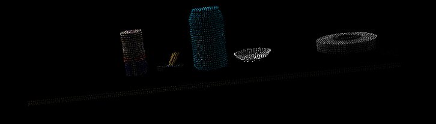

## Project: Perception

### Introduction  
The purpose of the perception project focuses the students to learn about visualizing and sorting through arryas of 3d point clouds and the different algorithms that are used to gain useful information about an environment.  The Project consisted of 3 exercises and a final project.  The exercies are designed to take a point cloud and apply different filters to segment a set of objects from an environment.  I will be discussing the details of each of the exercises and the final project.


### Ex 1
Exercise one consisted of reading in a point cloud through a ros susbscriber and applying a voxel downsampling grid, passthrough filter, Ransac segmentation, and outlier extraction.  These 4 steps allowed the user to take some objects on a table and extract only the objects.  The Voxel downsamplig filter takes a sample of the point cloud and extracts the point within a volume element size.  This volume element size determines the output resolution of the voxel filter.  I choose my value to be .01 for the exercises.  I choose a different value for the project but that will be discussed in detail later.  The code for the voxel downsample looks like this.  

```python
# Create a VoxelGrid filter object for our input point cloud
vox = cloud.make_voxel_grid_filter()

# Choose a voxel (also known as leaf) size
# Note: this (1) is a poor choice of leaf size   
# Experiment and find the appropriate size!
LEAF_SIZE = .01  

# Set the voxel (or leaf) size  
vox.set_leaf_size(LEAF_SIZE, LEAF_SIZE, LEAF_SIZE)

# Call the filter function to obtain the resultant downsampled point cloud
cloud_filtered = vox.filter()
filename = 'voxel_downsampled.pcd'
pcl.save(cloud_filtered, filename)
```

The next step for exercise 3 was to implement a passthrough filter to eliminate the bottom portion of the table and take as much of the table top away from the point cloud.  This fileter is axis specific with a minimuim and a maximum user specified values which limit the length of the clipping action.  The code to implement this passthrough filter looks like this.

```python
# PassThrough filter
# Create a PassThrough filter object.
passthrough = cloud_filtered.make_passthrough_filter()

# Assign axis and range to the passthrough filter object.
filter_axis = 'z'
passthrough.set_filter_field_name(filter_axis)
axis_min = .6
axis_max = 1.1
passthrough.set_filter_limits(axis_min, axis_max)

# Finally use the filter function to obtain the resultant point cloud. 
cloud_filtered = passthrough.filter()
filename = 'pass_through_filtered.pcd'
pcl.save(cloud_filtered, filename)
```
I set my values to .6 and 1.1 for the min and max values respectively.  I thought this did the best job of clipping the unwated information from the point cloud.

The next filter applied in exercise one was the RANSAC segmentation.  The purpose of the this filter allows ths user to identify unique shapes within an environment and then choose to extract the objects identified or the objects that represent the outliers.  The code used to accomplish this task is shown below.

```python
# Create the segmentation object
seg = cloud_filtered.make_segmenter()

# Set the model you wish to fit 
seg.set_model_type(pcl.SACMODEL_PLANE)
seg.set_method_type(pcl.SAC_RANSAC)

# Max distance for a point to be considered fitting the model
# Experiment with different values for max_distance 
# for segmenting the table
max_distance = 1
seg.set_distance_threshold(max_distance)

# Call the segment function to obtain set of inlier indices and model coefficients
inliers, coefficients = seg.segment()
```

Using all three code snippets above the final output image looks something like this.

### Ex1 extracted outliers




### Generic DH transformation matrix


### Transformation matrix frame 0 to 2


### Transformation matrix frame 2 to 4


### Transformation matrix frame 4 to 6


### Transformation matrix frame 0 to 2


### Inverse Kinematics
The approach used for finding the joing angles of the robotic arm as a function of the end effector postion consisted of breaking the robot into two seperate parts.  The wrist center comprised of 3 revolute joints and the first 3 joints of the robot leading up to the wrist center.  Although numerical methods exist to compute all 6 joint angles it can be difficult to arrive at the correct set of solutions without an accurate guess.  Computational time for numberical procedures can take signifigant periods of tie depending on the complexity and hardware used. There will be multiple answers for each joint angle but the joints themselves impose their own constraints depending on the joint type ie. (does the joint move in that direction or past a certain degree limit).  Because of these limitations and ease of calculation an analytical or closed form solution was used.  Mapping the geometry of the first 3 joints or up to the wrist center one can find the joint angles with simple geometry.  Angela Sodelman's videos on youtube were a big help in vizualization and methods to find the first 3 joint angles.  I opted to utilize the schematic provided from Udacity in the the inverse kinematics section.
Once the first three joint angles have been found, matrix multiplication will yield the last 3 joint angles.  This equation is shown below that the transpose of the rotation matrix from 0 to 3 muliplied with the Rotatio matrix from 0 to 6 will yield the last 3 joint angles.  

Finding the exaxt postion of the wrtist center required additional rotations to the transformation matrices derrived from the DH parameter table.  This was due to an offset between the gripper frame and frame 6.  An additional roation of 180 degrees around the z axis and -90 degree rotation about the y axis aligned these two frames.  

### Frame 0 to 3 inverse kinematic diagram


### Inverse kinematic frame 3 to EE


### Project Implementation
using the safe_spanwer script the gazebo, ros master, Rviz environments were brought up.  I had to leave the computer completely alone when allowing gazebo to start up.  It seemed like each time I tried to operate while gazebo was starting up it would crash and the process had to be completed again.  After these environements were started the IK_server.py scripts were run.  This scripts purpose was to receive the individual end effector postions from Moveit motion planning and calculate the joint angles need to place the end effector in the correct position.  Initially the two program worked well together with the pick and place operation completing successfully, but the path that moveit would plan would sometimes deviate wildly from what the shortest path actually was.  I searched and found within the moveit::planning interface::MoveGroup class there was an option to set the minimum number of path planning attempts to calculate and find the shortest path.  I set this minimum number to 10 for both the move group and the end effector group.  After adding this piece of code to the trajectory_sampler.cpp file the ROS environment was refreshed using catkin_make to rebuild.  After this Moveit did a resonably good job with calculating the minimum distance between the start and end pose.  Running the simulation through 10 cycles of pick an place operations the robot failed to pick up the cylinder one time.  This was during a period when the continue button was pushed and the robot acted without user input.  A sleep period was added to the trajectory_sampler file to prevent the gripper arm from moving before the gripper had to time to fully contract.  This correction usually allowed the robot arm to operate without user input, but every know and then it woudl fail to pick up the cylinder.      

### trajectory_sampler code addition


trajectory_sampler_snip.PNG
### Project Completion


### Conclusion
overall I found this project very interesting and a useful process to have starting my path down the software side of robotics.  I found the most difficult information to process was the DH parameter configuration, especially the combination of the frames at the wrist center.  Watching tutorials on Youtube a different DH instruction set was used but I understand that combining the frames at the wrist center actually simplifies the transforms between the frames.  Going forward I would like to spend more time trying to understand ROS industrial software for path planning.  the IK_server script worked okay but in a tight spot or manufacturing environment the user would want the paths to be as optimized as possible.  this would decrease excessive wear on robot components and decrease the time it takes to  perform a pick and place operation.


